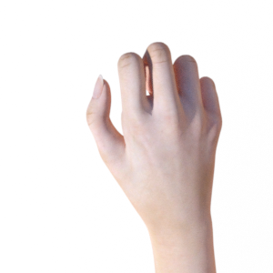
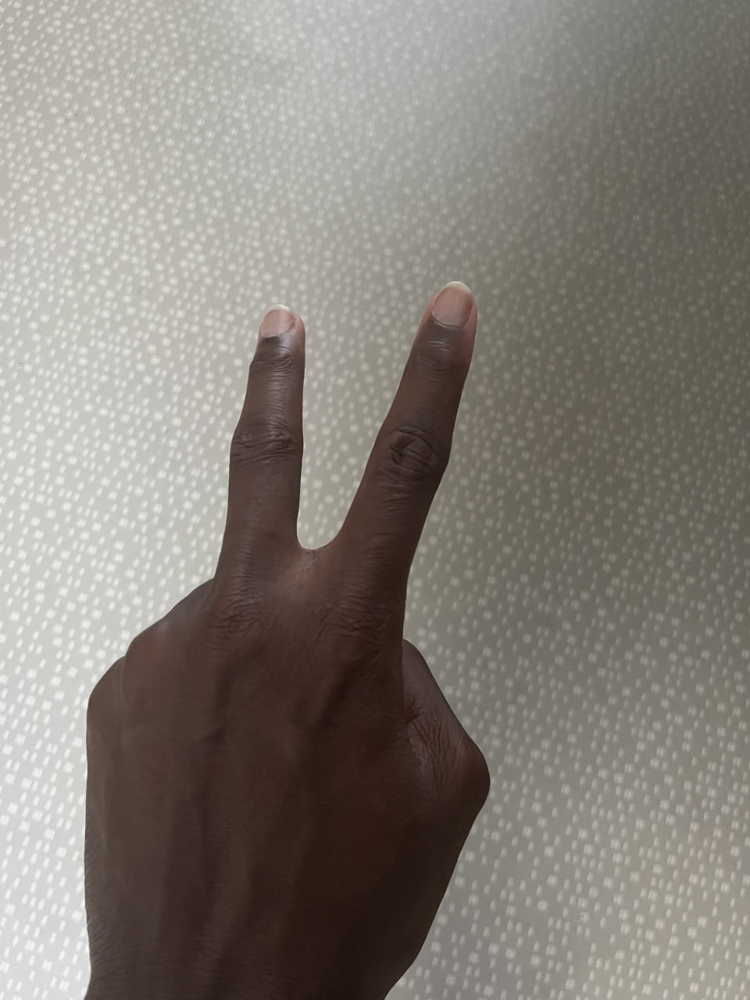

# RockPaperScissorClassifier

Un classificateur d'images qui permet de distinguer les gestes de mains en forme de pierre, feuille et ciseau.


## Lien de l'API

[https://image-classifier-563965826134.europe-west9.run.app](https://image-classifier-563965826134.europe-west9.run.app)

## Prérequis

- Python 3.x
- Flask
- TensorFlow/Keras
- NumPy

## Contenu

1. Dossier model:  
   Contient le notebook qui crée le model utilisé.

2. Dossier test :
    Contient les différents test de deploiement.

## Utilisation de l'API

Voici comment fonctionne l'API :

### Endpoint `/`

Retourne un message de bienvenue.

**Méthode** : GET

**Réponse** :
```json
{
  "message": "Welcome on my rock-paper-scissor api prediction"
}
```
### Endpoint `/predict`

Retourne un message de bienvenue.

**Méthode** : POST

**Parametres** : 
```bash
file: L'image à classer (format .jpg, .png, etc.)
```


**Réponse** :
```json
{
  "prediction": "Rock"  // Exemple de prédiction possible : Rock, Paper, Scissor
}
```

## Exemples d'images que ça peut reconnaître



